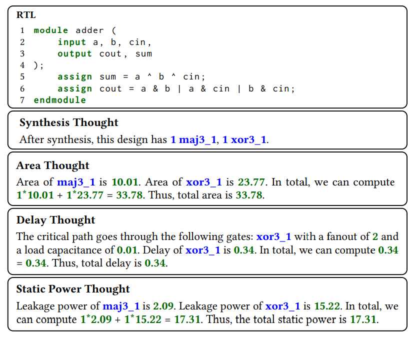

# :crystal_ball: MetRex
A Benchmark for Verilog Code Metric Reasoning Using LLMs

# Overivew
MetRex contains **25,868** Verilog modules along with their post-synthesis metrics (area, delay, static power) explained in natural language format. The synthesis results are obtained using [Yosys](https://github.com/YosysHQ/yosys) and the [Skywater](https://github.com/google/skywater-pdk) 130nm PDK.



🤗  [MetRex](https://huggingface.co/datasets/scale-lab/MetRex)

# Dataset

Download [MetRex](https://huggingface.co/datasets/scale-lab/MetRex) directly from HuggingFace. 

```python
# pip install datasets
from datasets import load_dataset

ds = load_dataset("scale-lab/MetRex", split="train")
print(next(iter(ds)))
```

MetRex contains detailed natural language instructions on computing area/delay/static power metrics of verilog designs. 

- Check [README.md](src/data/README.md) for utility scripts used for cleaning the dataset. 
- Check [README.md](src/synth/README.md) for utility scripts used for synthesizing the designs and creating the natural language instructions from the synthesis results. 

# Running Instructions 

First install dependencies: 

- torch
- [unsloth](https://github.com/unslothai/unsloth) 

`pip install -r requirements.txt` 

## Supervised Finetuning 

We use QLoRA for a faster and memory efficient finetuning. The finetuning configurations are specified with a YAML file as specified [here](src/config/experiments/llama3_r128.yaml). 

```
python -m model.sft --config <path-to-yaml-config> --metric <area/delay/power>
```

For exmaple to finetune [Llama3-8b-Instruct]() with [unsloth](https://github.com/unslothai/unsloth) for faster finetunning, run the following: 

```
python -m model.sft --config config/experiments/llama3_r64.yaml --use_sloth --metric area 
```

## Inference 

You can access the finetuned LoRA adapters from [HF](https://huggingface.co/collections/scale-lab/metrex-67885576652132375515562a) directly to run inference: 
```
python -m model.eval --metric <metric-area/delay/power> --temperature 0.4 --config config/experiments/llama3_r128.yaml --adapter <adapter-hf-name> --eval eval/eval.json --output_dir . > logs/eval.log  2>&1 &
```

For exammple to run area, use: 

```
python -m model.eval --metric area --temperature 0.4 --config config/experiments/llama3_r128.yaml --adapter scale-lab/Llama3-MetRex-Area-8b --eval eval/eval.json --output_dir . > logs/eval_area.log  2>&1 &
```

Or use your own finetuned adapters: 
```
python -m model.eval --metric <metric-area/delay/power> --temperature 0.4 --config config/experiments/llama3_r128.yaml --adapter <path-to-checkpoint> --eval eval/eval.json --output_dir . > logs/eval.log  2>&1 &
```

# Citation
```
@INPROCEEDINGS{abdelatty2025metrex,
    author={M. {Abdelatty} and J. {Ma} and S. {Reda}},
     booktitle={2025 30th Asia and South Pacific Design Automation Conference (ASP-DAC)},
     title={MetRex: A Benchmark for Verilog Code Metric Reasoning Using LLMs},
     year={2025},
     volume={},
     number={},
}
```

## License
BSD 3-Clause License. See [LICENSE](LICENSE) file
